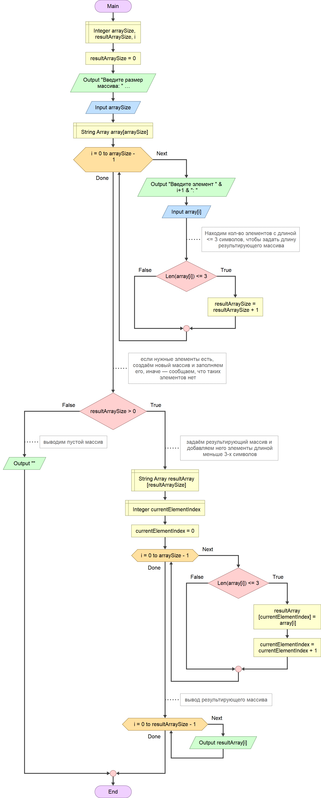

# Контрольная работа за 1-ю четверть

---

репозиторий: https://github.com/CodeMysteryShack/GB_1st_Control_Work.git

## Описание

Массив вводит пользователь. Вначале вводится размер массива, затем — каждый элемент. Программа работает в том числе с размером исходного массива, равным **`0`** — будет выведено `[ ] -> [ ]`.

### Алгоритм

### Описание работы программы

#### Функция PrintArray

Функция **PrintArray** выводит массив в консоль. Принимает на вход одномерный строчный массив и необязательный параметр `breakLine` типа *bool* (по умолчанию равный `false`), указывающий нужно ли делать перенос строки после вывода.

#### Порядок выполнения программы
1. Первым циклом пользователем по-элементно вводится массив. После ввода каждого элемента проверятся его длина (<=3), чтобы понять какой длины будет результирующий массив.
2. В случае если, такие элементы найдены, ещё раз проходим циклом по исходному массиву, и копируем элементы, удовлетворяющие условиям, в результирующий массив. Выводим результат.
3. Если искомые элементы не найдены, выводим соответсвующие сообщение.
